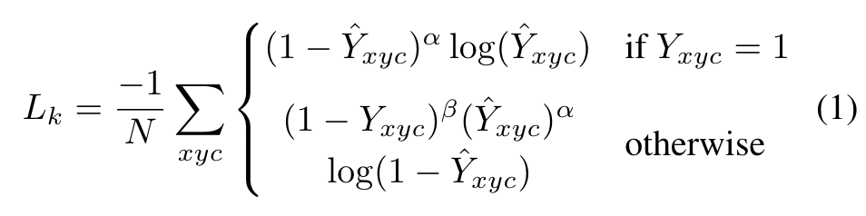
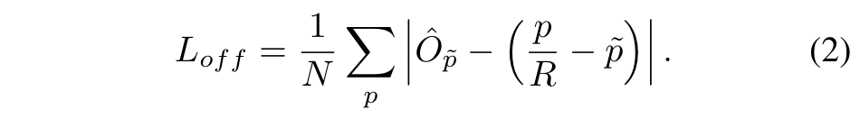

# Objects as Points Review 
Author **Heo-Jeong-Eun**

## Abstract

- 대부분의 Object Detector는 잠재적인 Object의 위치의 거의 모든 List를 열거하고 분류한다. 이는 **비효율적**이며 **추가적인 후처리가 필요**하다.
- 이 논문은 다른 접근 방식을 제시한다.
- 물체를 BBox 중심의 단일 점으로 Modeling한다.
- **Key Point Estimation을 사용**해 중심점을 찾고 **Size, 3D Location, Orientation, Pose**와 같은 모든 Object Prop으로 **Regresses**한다.
- Center Point-Based 접근 방식인 **CenterNet**은 BBox-Based Detector보다 **End-to-End 차별성이** 뛰어나고, 간단하며 빠르고 정확하다.
    
    
    
---

## Introduction

- Object Detection은 Segmentation, Pose Estimation, Tracking, Action Recognition과 같은 수많은 Vision 작업을 지원한다.
- 현재의 Object Detector는 Object를 감싸는 축 정렬 BBox를 통해 Objcet를 나타낸다. 그리고 Object Detection을 광범위한 수의 잠재적인 BBox의 이미지 분류로 축소한다. 각 BBox는 이미지가 특정 물체인지, 배경인지 결정한다.
    - 1단계 Detector는 Anchors라고 하는 가능한 BBox의 복잡한 배열을 이미지 위로 밀어넣고 BBox 구성 요소를 지정하지 않고 직접 분류한다. 
    - 2단계 Detector는 잠재적 Box에 대한 이미지 특징을 다시 계산한 다음 특징을 분류한다. 후처리, 즉 최대값을 억제를 수행한 후 BBox IoU를 결합하여 동일한 Instance에 대해 중복된 Detection를 다시 이동시킨다. 이러한 후처리는 구별하고 Training하기 어렵기 때문에 대부분의 Detector는 End-to-End Training이 불가능하다. 
- 이 논문에서는 훨씬 더 간단하고 효율적인 방법을 제안한다.
- **BBox 중앙에 있는 단일 점으로 Object를 표현하고 Size, 3D Location, Orientation, Pose와 같은 Object Prop은 중심 위치의 이미지 특징에서 직접 Regresses한다.**
- Object Detection은 Key Point Estimation 문제인데, 입력 이미지를 Fully Convolutional Network에 공급하면 Heatmap이 생성된다. 이 **Heatmap의 Peaks는 Object의 중심점**에 해당한다. **각 Peaks 이미지 특징은 상자 높이와 무게를 포함하는 물체를 예측**한다.
- 이 Model은 **Standard Dense Supervised Learning**을 한다.
- Inference는 후처리를 위한 비최대 억제 없이 Single Network Forward-Pass로 이루어진다.
- 사람의 Pose Estimation을 위해 2D 관절 위치를 중심으로부터 Offset으로 간주하고 중심점 위치에서 직접 Regresses한다.
- CenterNet은 방법이 단순하기 때문에 매우 빠른 속도로 실행할 수 있다.

    
    
---

## Related Work

- **Object Detection by Region Classfication**
    - RCNN은 대규모 Candidates Set에서 Object 위치를 통합하고, 이를 자른 다음 Deep Network를 사용하여 각각 Classfication 한다.
    - Fast-RCNN은 이미지 특징을 잘라내 계산을 절약한다.
    - 하지만 두 방법 모두 느린 Low-Level Region에 의존한다.
- **Object Detection with Implicit Anchors**
    - 더 빠른 RCNN은 Detection Network 내 영역 제안을 생성한다.
    - 저해상도 이미지 그리드 주변의 고정된 모양의 BBox(Anchors)를 Sampling하고 각각 Foreground인지 아닌지 분류한다.
    - Proposal Classifier를 Multi-Class Classification으로 변경하는 것으로 One-Stage Detectors의 기초를 형성한다.
    - 이 논문은 Anchors-Based One-Stage 접근 방식과 밀접한 관련이 있다.
    - 중심점은 모양에 구애받지 않는 단일 Anchor로 볼 수 있지만 몇가지 중요한 차이점이 있다.
        - CenterNet은 Box Overlap이 아닌 위치만을 기준을 Anchor를 할당한다. 
        Foreground와 Background를 Classification하기 위한 Threshold가 없다.
        - Objcet 하나 당 하나의 Anchor만 있으므로 NMS가 필요하지 않다. 
        Key Point Heatmap에서 Local Peaks를 추출하기만 하면 된다.
        - CenterNet은 기존의 Object Detector에 비해 더 큰 출력 해상도를 사용한다. 
        따라서 여러 Anchors가 필요하지 않다.
- **Object Detection by Key Point Estimation**
    - CornerNet은 두 개의 BBox 모서리를 Key Point로 감지하고, ExtremeNet은 모든 Object의 상하좌우 가장 중심점을 감지한다. 이 두 방법 모두 CenterNet과 동일한 Robust Key Point Estimation Network-Based이다.
    - Key Point 감지 후 Combination Grouping 과정이 필요하기 때문에 각 알고리즘의 속도가 상당히 느려질 수 있다.
    - 반면 CenterNet은 Grouping이나 후처리 없이 Object 하나의 중심점을 추출하기만 하면 된다.
- **Monocular 3D Object Detection**
    - 3D BBox Estimation으로 자율주행을 지원한다.
    - Deep3dBox는 먼저 2D Object를 감지한 후 Object를 3D Estimation Network에 공급하는 방식으로 느린 RCNN 방식의 Framework를 사용한다.
    - RCNN은 Faster-RCNN에 Head를 추가한 후 3D Projection을 수행한다.
    - Deep Manta는 Coarse-to Fine Faster-RCNN을 사용한다.
    - 이 논문의 방법은 Deep3DBox 혹은 3DRCNN의 1단계 방법과 유사하다. 
    따라서 CenterNet은 다른 방법보다 훨씬 간단하고 빠르다.
    
    

---

## Preliminary

- 이미지를 I ∈ R^(W * H * 3)이라 하고, 모델의 목표는 Key Point Heatmap을 추론하는 것이기 때문에 이 Heatmap을 Y ∈ [0, 1]^(W / R * H / R * C)라고 한다.
    - 여기서 R은 Ouput Stride이며, C는 Key Point Type Number라고 보면 된다.
- Key Point Type은 Human Pose Estimation에서는 17개(17개의 Joint)이고, Object Detection에서는 Category 개수인 80개가 된다.
- Default Output Stride로 R = 4를 사용하게 되며, 이를 통해 이미지가 Downsample 된다.
- Y x, y, z는 올바르게 Key Point가 예측된다면 1 값을 가진다. 0인 것은 Background라고 보면 된다.
- 이 논문에서 Model은 **Fully Convolutional Encoder-Decoder Network는 Stacked Hourglass Network, Up-Convolutional Residual Network(ResNet), Deep Layer Aggregation(DLA)를 사용**한다.
- **Key Point Prediction Network는 ConnerNet 방법을 따른다.**
    - 각 Class에 대한 GT Key Point가 있으면, Low-Resolution Equivalent p ∈ R^2 값을 계산한다.
    - 그 다음 Gaussian Kernel을 이용하여 Heatmap을 생성하여 같은 Class의 Two Gaussian이 겹쳐지면 Element-Wise Maximum을 계산한다.
    - Loss 함수는 아래 공식과 같이 **Focal Loss**를 사용한다.
        
        
        
    - 여기서 α와 β는 Focal Loss의 Hyper-Parameter이다.
    - N은 이미지에서의 Key Point 갯수이고, 이는 GT 위치에 대해 Positive Focal Loss Instance 1을 갖게 된다.
        - 이 논문에서는 α = 2, β = 4를 사용하였다고 한다.
    - Discretization Error를 개선하기 위해 각 중심점으로부터 Local Offset O ∈ R ^ (W / R * H / R * 2)를 추가로 계산한다.
    - 모든 Class는 동일한 Offset Prediction을 공유하게 되며 Offset은 다음과 같이 **L1 Loss**로 학습된다.
        
        
        
    - Key Point Location에 대해서만 학습되고, 나머지 Location은 무시된다.

---

## Object as Points

- **L1 Loss을 중심점에 적용시킨다. Scale 값을 Normalize 하지 않고 직접적으로 Raw Pixel에 대해 Coordinates를 구한다.**
- 따라서 λ {size}를 통해 직접적으로 Loss를 조절한다. 전체 손실 함수는 아래 공식과 같다.
    
    
    
- Network는 C + 4 Output 각각 Location에 대해 예측한다.
- **From Points to BBox**
    - Inference 시간에 독립적으로 각 Category의 Heatmap에서 Peaks를 추출한다.
    - Key Point Value인 Y {x, y, c}를 통해 Detection Confidence를 측정하고 BBox의 Location을 생산한다.
    - Peak Key Point 추출은 효율적인 NMS 대안으로 작동한다. 또한 3 X 3 Max Pooling 연산을 통해 Device에서 효율적으로 실행될 수 있다.

### 3D Detection

- 3D Detection 3개의 차원으로 BBox를 평가한다. 그리고 3개의 속성이 필요한데 이는 Center Point와 Depth로 별도의 Head를 구성하여 진행한다.
- Depth는 Center Point Single Scalar 값이다. 하지만 Depth는 직접적으로 Regression 되기 힘들다. 따라서 Output에 대해 Transformation을 적용한다.
- 이전과 다르게 Output Layer에서 Inverse Sigmoidal Transformation을 사용한다. 이후 Origin Depth Domain에 L1 Loss를 적용하여 Depth를 추정한다.

### Human Pose Estimation

- Human Pose Estimation은 이미지에서 Human Instance에 대해 k 2D Human Joint Location을 찾는 것을 목표로 한다.
    - Center Point에 대해 Pose가 k * 2 - Dimensional Property를 갖는다.
- Joint Offset에 대해 L1 Loss를 사용하여 직접적으로 Regression 한다. 그리고 Human Joint Heatmap은 Focal Loss를 사용하여 Training 한다.

---

## Implementation Detatils

- 4개의 Architecture로 실험을 했다. ResNet과 Deformable Convolution Layers를 사용한 DLA-34를 모두 Modify 했고, Howrglass Network를 있는 그대로 사용했다.

    

---

## Experiments

### Object Detection

### 3D Detection

### Pose Estimation

---

## Conclusion

- Object를 점으로 표현하는 새로운 방식을 제안한다.
- CenterNet Object Detector는 성공률 높은 Key Point Estimation Network-Based로 구축되어 Object 중심점을 찾고, 그 Size로 Regresses 한다.
- 이 알고리즘은 간단하고, 빠르고, 정확도가 높고, NMS 후처리 없이 End-to-End 구분이 가능하다.
- 이는 일반적이며 단순한 2차원 Detection 이외에도 광범위하게 응용될 수 있다.
- CenterNet은 Pose, 3D Orientation, Depth, Extent와 같은 다양한 Object Props을 One Single Forward Pass로 추정할 수 있다.

---

## Review Reference

[GitHub - xingyizhou/CenterNet: Object detection, 3D detection, and pose estimation using center point detection:](https://github.com/xingyizhou/CenterNet)

[[Object Detection] CenterNet (Objects as Points) 논문 리뷰](https://nuggy875.tistory.com/34)

[[Paper Review] CenterNet, Objects as Points](https://eehoeskrap.tistory.com/674)

[[CenterNet] CenterNet (Objects as Points)](https://gaussian37.github.io/vision-detection-centernet/)

---